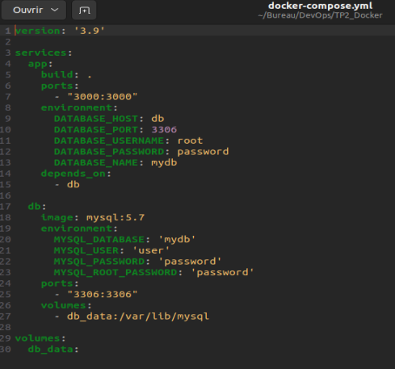
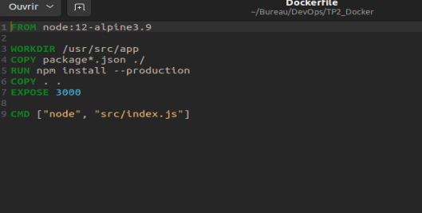

# TP2_Docker

# 1. Récupérer le zip TP-2-Docker.zip sur Moodle...

## J'ai récupérer le zip et je l'ai modifié:

- J'ai changé mon docker-compose.yml

- J'ai changé mon Dockerfile

# 2
## a

L'option de npm qui permet d'installer uniquement les dépendances nécessaires à l'exécution de l'application, et non les dépendances de développement, est --only=production ou --production. Lorsque vous exécutez npm install --production, npm ne télécharge et n'installe que les paquets déclarés dans la section dependencies du fichier package.json et ignore ceux de devDependencies.