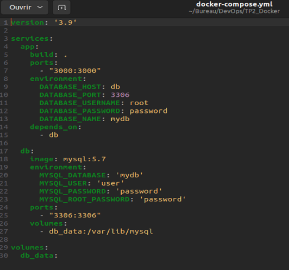
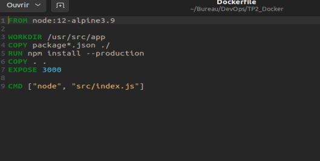
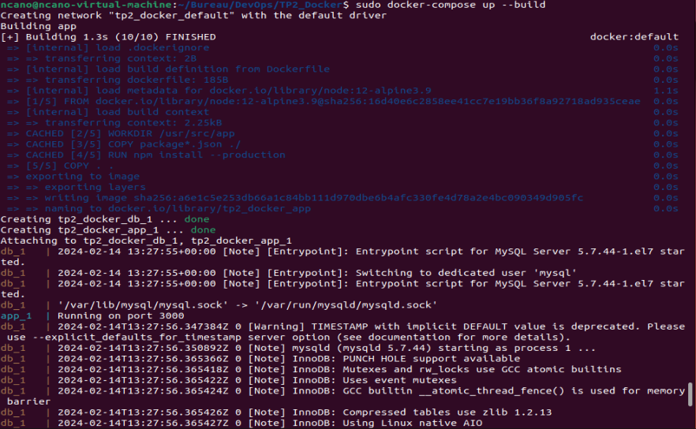
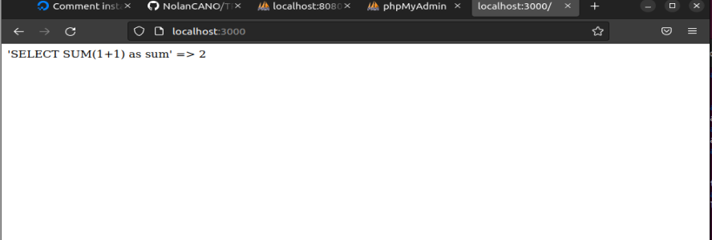
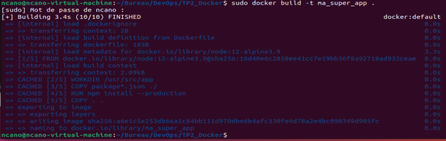
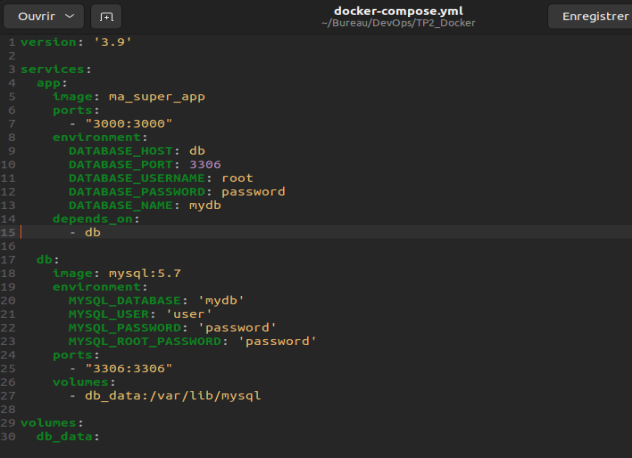
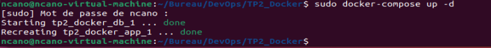
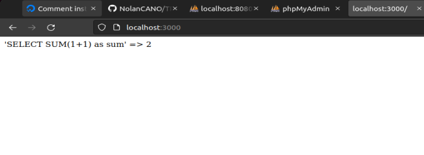

# TP2_Docker

# 1. Récupérer le zip TP-2-Docker.zip sur Moodle...

# 2. Compléter le Dockerfile afin de builder correctement l’application contenu dans src/

## J'ai récupérer le zip et je l'ai modifié :

- J'ai changé mon docker-compose.yml :

- J'ai changé mon Dockerfile :

- J'ai testé avec un "*docker-compose up --build*" :

- Et j'ai testé "*http://localhost:3000*" :

## a. Une option de npm vous permet de n’installer que ce qui est nécessaire. Quelle est cette option ? Quelle bonne pratique Docker permet t-elle de respecter ?

L'option de npm qui permet d'installer uniquement les dépendances nécessaires à l'exécution de l'application, et non les dépendances de développement, est --only=production ou --production. Dans mon cas, lorsque j'exécutez npm install --production, npm ne télécharge et n'installe que les paquets déclarés dans la section dependencies du fichier package.json et ignore ceux de devDependencies.

# 3. A l’aide de la commande docker build, créer l’image ma_super_app

## J'ai utiliser la commande "*docker build -t ma_super_app*" :

# 4. Compléter le fichier docker-compose.yml afin d’éxécuter ma_super_app avec sa base de données.

- J'ai changé la clé "*build: .*" pour "*image: ma_super_app:*"

- Après avoir apporté ces modifications, j'ai exécuté :

---

*by Nolan*